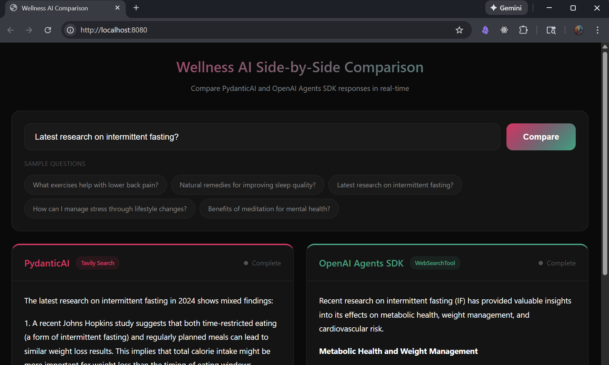

# Dense Vector Retrieval & RAG

**Session 2: Embeddings and RAG** - Build a Personal Wellness Assistant using Retrieval Augmented Generation.

## Overview

This repository demonstrates RAG (Retrieval-Augmented Generation) pipelines through three implementations of a wellness assistant:

| Implementation | File | Description |
|----------------|------|-------------|
| **PydanticAI** | `wellness_assistant_pydantic_ai.py` | Type-safe agent with custom VectorDatabase |
| **OpenAI Agents SDK** | `wellness_assistant_openai_agents.py` | Managed vector store + WebSearchTool |
| **Comparison App** | `comparison_app.py` | Side-by-side streaming comparison UI |

All implementations use the same knowledge base: `data/HealthWellnessGuide.txt`



## Quick Start

```bash
# 1. Setup environment
uv venv && source .venv/bin/activate && uv sync

# 2. Set API keys
export OPENAI_API_KEY="sk-..."
export TAVILY_API_KEY="tvly-..."  # optional, enables web search

# 3. Run any implementation
python wellness_assistant_pydantic_ai.py    # PydanticAI standalone
python wellness_assistant_openai_agents.py  # OpenAI Agents standalone
python comparison_app.py                     # Side-by-side comparison UI
```

## Project Structure

```
.
├── README.md                              # This file
├── CLAUDE.md                              # AI assistant instructions
├── pyproject.toml                         # Dependencies (uv/pip)
├── comparison_app.py                      # FastAPI side-by-side comparison
├── wellness_assistant_pydantic_ai.py      # PydanticAI implementation
├── wellness_assistant_openai_agents.py    # OpenAI Agents implementation
├── aimakerspace/                          # Core RAG library
│   ├── text_utils.py                      # TextFileLoader, CharacterTextSplitter
│   ├── vectordatabase.py                  # In-memory VectorDatabase
│   └── openai_utils/                      # OpenAI wrappers
│       ├── embedding.py                   # EmbeddingModel
│       ├── chatmodel.py                   # ChatOpenAI
│       └── prompts.py                     # Role-based prompts
├── data/
│   └── HealthWellnessGuide.txt            # Wellness knowledge base
└── workspace/                             # Presentation materials
```

## Environment Variables

Create a `.env` file:

```bash
OPENAI_API_KEY=sk-...          # Required
TAVILY_API_KEY=tvly-...        # Optional (enables PydanticAI web search)
```

## Implementations

### 1. PydanticAI (`wellness_assistant_pydantic_ai.py`)

Type-safe agent framework using your own `VectorDatabase`:

```python
python wellness_assistant_pydantic_ai.py
```

**Features:**
- Reuses `aimakerspace.VectorDatabase` (DIY retrieval)
- Type-safe responses via Pydantic models
- Tavily web search for current research
- Clean dependency injection pattern

### 2. OpenAI Agents SDK (`wellness_assistant_openai_agents.py`)

Managed infrastructure with built-in tools:

```python
python wellness_assistant_openai_agents.py
```

**Features:**
- OpenAI-managed vector store (automatic chunking/embedding)
- Built-in `FileSearchTool` with hybrid search
- Built-in `WebSearchTool` for current information
- Automatic cleanup on exit

### 3. Comparison App (`comparison_app.py`)

Real-time side-by-side streaming comparison:

```python
python comparison_app.py
# Open http://localhost:8080
```

**Features:**
- FastAPI + Server-Sent Events (SSE)
- Both implementations run simultaneously
- Live streaming with typing animation
- Response metadata (timing, sources, confidence)

## Comparison App Details

### Using the UI

1. Enter a wellness question or click a sample
2. Click **Compare** to stream both responses
3. Watch real-time streaming in both panels
4. Compare metadata after completion

### Sample Questions

- "What exercises help with lower back pain?"
- "Natural remedies for improving sleep quality?"
- "Latest research on intermittent fasting?"
- "How can I manage stress through lifestyle changes?"

### API Endpoints

| Endpoint | Description |
|----------|-------------|
| `GET /` | Comparison UI |
| `GET /api/stream/pydantic?q=...` | PydanticAI SSE stream |
| `GET /api/stream/openai?q=...` | OpenAI Agents SSE stream |
| `GET /api/health` | Health check |

### Architecture

```
┌─────────────────────────────────────────────────────────────┐
│                    Frontend (HTML/JS)                       │
│  ┌──────────────────────┐  ┌──────────────────────────────┐ │
│  │   PydanticAI Panel   │  │   OpenAI Agents Panel        │ │
│  └──────────────────────┘  └──────────────────────────────┘ │
└─────────────────────────────────────────────────────────────┘
                    │                      │
                    ▼                      ▼
┌───────────────────────────┐  ┌─────────────────────────────┐
│  Custom VectorDatabase    │  │  OpenAI Managed Store       │
│  + Tavily Web Search      │  │  + Built-in WebSearchTool   │
└───────────────────────────┘  └─────────────────────────────┘
```

## Key Differences

| Aspect | PydanticAI | OpenAI Agents |
|--------|------------|---------------|
| Vector Store | Custom `VectorDatabase` | OpenAI managed |
| Chunking | You control (1000/200) | Managed (800/400) |
| Embeddings | `text-embedding-3-small` | `text-embedding-3-large` |
| Search | Cosine similarity | Hybrid + reranking |
| Web Search | Tavily | Built-in tool |
| Type Safety | Full Pydantic | Runtime only |

## Core Library (`aimakerspace/`)

The `aimakerspace` package provides foundational RAG components:

```python
from aimakerspace.text_utils import TextFileLoader, CharacterTextSplitter
from aimakerspace.vectordatabase import VectorDatabase

# Load and chunk documents
loader = TextFileLoader("data/HealthWellnessGuide.txt")
documents = loader.load_documents()

splitter = CharacterTextSplitter(chunk_size=1000, chunk_overlap=200)
chunks = splitter.split_texts(documents)

# Build vector database
vector_db = VectorDatabase()
vector_db = await vector_db.abuild_from_list(chunks)

# Search
results = vector_db.search_by_text("stress management", k=4)
```

## Troubleshooting

**"Pipeline not initialized"**
- Wait for startup (~30-60 seconds)
- Check `/api/health` for status

**Web search disabled**
- Set `TAVILY_API_KEY` for PydanticAI
- OpenAI Agents has built-in web search

**Port 8080 in use**
- Edit `comparison_app.py` line 1007: `port=8080`

**Rate limits**
- Wait and retry; both implementations make concurrent API calls

## Learning Objectives

After working through this code, you should understand:

1. **Embeddings** - Text → numerical vectors capturing semantic meaning
2. **Chunking** - Splitting documents affects retrieval quality
3. **Vector Search** - Cosine similarity finds relevant content
4. **RAG Pattern** - Retrieve → Augment → Generate
5. **Framework Trade-offs** - DIY control vs managed convenience
